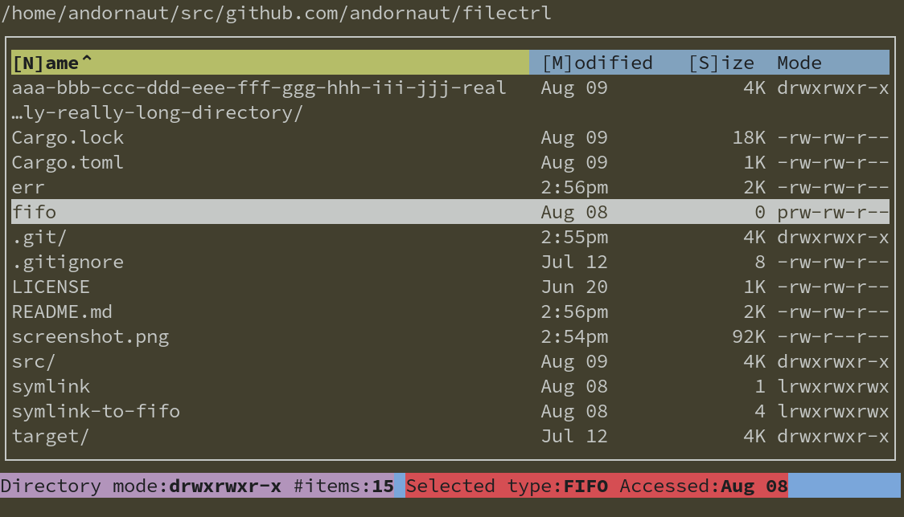

# FileCTRL

FileCTRL is a light, opinionated, responsive, theme-able, and simple Text User Interface (TUI) file manager for Linux and macOS



## Installation

1. `git clone` and `cd` into this repository
1. Run ```cargo build --release && cp target/release/filectrl ~/.local/bin/```

## Usage

Run `filectrl --help` to view the available command line arguments and options:

```text
Usage: filectrl [<directory>] [-c <config>] [--write-config]

FileCTRL is a light, opinionated, responsive, theme-able, and simple
Text User Interface (TUI) file manager for Linux and macOS

Positional Arguments:
  directory         path to a directory to navigate to

Options:
  -c, --config      path to a configuration file
  --write-config    write the default config to ~/.config/filectrl/config.toml,
                    then exit
  --help            display usage information
```

### Keyboard controls

***Normal mode***
Keys | Description
--- | ---
q | Quit
j / k | Move selection down / Up
Backspace, Left, b, h | Navigate to the parent directory
Enter, Right, f, l | Open the selected file or navigate to the selected directory
CTRL+f, PgDn | Move selection and scroll down one page
CTRL+b, PgUp | Move selection and scroll up one page
Delete | Delete the selected file or directory
r, F2 | Rename the selected file or directory
Space | Deselect a selection if applicable
CTRL+r, F5 | Refresh
n | Sort by name (toggle direction if already sorted)
m | Sort by modified (toggle direction if already sorted)
s | Sort by size (toggle direction if already sorted)
e | Clear error messages
? | Toggle help

***Filtered mode***
Keys | Description
--- | ---
Esc | Exit filtered mode

***Input mode***
Keys | Description
--- | ---
Esc | Exit input mode
Enter | Submit your input and exit input mode

## Configuration

The configuration is drawn from the first of the following:

1. The path specified by the command line option: `--config-path`
1. The default path, if it exists: `~/.config/filectrl/config.toml`
1. The built-in [default configuration](./src/app/default_config.rs)

Run `filectrl --write-config` to write the [default configuration](./src/app/default_config.rs) to `~/.config/filectrl/config.toml`.

### Opening in other applications

* [andornaut@github /til/ubuntu#default-applications](https://github.com/andornaut/til/blob/master/docs/ubuntu.md#default-applications)
* [XDG MIME Applications](https://wiki.archlinux.org/title/XDG_MIME_Applications)

Keyboard key | Description
--- | ---
f | Open the selected file using the default application configured in your environment
o | Open the selected file using the program configured by: `open_selected_file_template`
t | Open the current directory in the program configured by: `open_current_directory_template`
w | Open a new `filectrl` window in the terminal configured by: `open_new_window_template`

```toml
# %s will be replaced by the current directory path:
open_current_directory_template = "alacritty --working-directory %s"
# %s will be replaced by the selected file or directory path:
open_selected_file_template = "pcmanfm %s"
```

### Theming

All colors can be changed by editing the configuration file:

```bash
filectrl --write-config
vim ~/.config/filectrl/config.toml
```

You can see all of the available theme variables in the [default configuration](./src/app/default_config.rs).

### Desktop entry

* ["Desktop Entry" specification](https://specifications.freedesktop.org/desktop-entry-spec/desktop-entry-spec-latest.html)

You can make `filectrl` the default application for opening directories. Start by copying the [`filectrl.desktop` file](./filectrl.desktop) to `~/.local/share/applications/`:

```bash
cp filectrl.desktop ~/.local/share/applications/
xdg-mime default filectrl.desktop inode/directory
update-desktop-database ~/.local/share/applications/
```

## Developing

* [andornaut@github /til/rust](https://github.com/andornaut/til/blob/master/docs/rust.md)
* See [Cargo.toml](./Cargo.toml) for dependencies.

```bash
cargo clippy
cargo fix --allow-dirty --allow-staged
cargo test
cargo run
cargo build --release
./target/debug/filectrl
```

### Git hooks

* [cargo-husky](https://github.com/rhysd/cargo-husky)

[Changing cargo-husky configuration](https://github.com/rhysd/cargo-husky/issues/30):

1. Edit the `[dev-dependencies.cargo-husky]` section of [Cargo.toml](./Cargo.toml)
1. `rm .git/hooks/pre-commit` (or other hook file)
1. `cargo clean`
1. `cargo test`
1. Verify that the changes have been applied to `.git/hooks/pre-commit`
