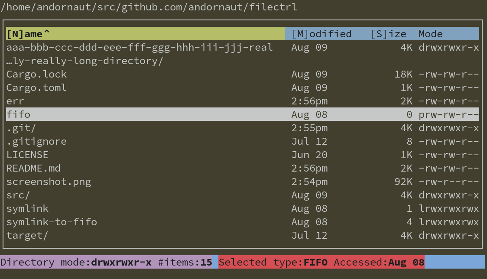

# FileCtrl

FileCtrl is a light, opinionated, responsive, theme-able, and simple Text User Interface (TUI) file manager for Linux and macOS



## Installation

You can [download and install a pre-built binary](https://github.com/andornaut/filectrl/releases) for Linux or macOS:

```bash
curl -sL https://github.com/andornaut/filectrl/releases/latest/download/filectrl-linux -o filectrl
chmod +x filectrl
sudo mv filectrl /usr/local/bin/
```

On macOS, allow the _unsigned_ `filectrl` binary to be executed:

```bash
xattr -d com.apple.quarantine filectrl
```

## Building

1. `git clone` and `cd` into this repository
1. Run ```cargo build --release && sudo cp target/release/filectrl /usr/local/bin/```

## Usage

Run `filectrl --help` to view the available command line arguments and options:

```text
Usage: filectrl [-c <config>] [-i <include>] [--write-default-config] [--write-default-themes] [--colors-256] [--] [<directory>]

FileCTRL is a light, opinionated, responsive, theme-able, and simple Text User Interface (TUI) file manager for Linux and macOS

Positional Arguments:
  directory         path to a directory to navigate to

Options:
  -c, --config      path to a configuration file
  -i, --include     include a TOML file to merge on top of the config
                    (repeatable; later files take precedence)
  --write-default-config
                    write the default config to ~/.config/filectrl/config.toml,
                    then exit
  --write-default-themes
                    write default theme files to ~/.config/filectrl/, then exit
  --colors-256      force 256-color theme (disables truecolor detection)
  --help, help      display usage information
```

### Copy / paste

When you copy/cut a file or directory, FileCtrl puts `${operation} ${path}` into your clipboard buffer
(where `operation` is "cp" or "mv").
If you then paste into a second FileCtrl window, this second instance of FileCtrl will perform the equivalent of:
`${operation} ${path} ${current_directory}`, e.g. `cp filectrl.desktop ~/.local/share/applications/`.
Under the hood, FileCtrl doesn't actually invoke `cp` or `mv`, but implements similar operations using the Rust standard library.

### Marking files

Mark files to apply bulk operations (copy, cut, delete) to multiple items at once.

- <kbd>v</kbd> toggles a mark on the current item
- <kbd>V</kbd> enters **range mode**: the current row becomes the anchor, and moving the cursor (arrow keys or clicking) extends the marked range from the anchor to the cursor
- Press <kbd>V</kbd> again to exit range mode (marks are kept)
- While marks exist, clicking an unmarked row adds it to the marks; clicking a marked row removes it
- In range mode, clicking always extends the range from the anchor to the clicked row
- <kbd>Esc</kbd> clears all marks and exits range mode
- Marks and clipboard are mutually exclusive — marking clears the clipboard

### Keybindings

_**Normal mode**_

Actions | Keys
--- | ---
Quit | <kbd>q</kbd>
Go to parent dir | <kbd>←</kbd>/<kbd>h</kbd>/<kbd>b</kbd>/<kbd>Backspace</kbd>
Open | <kbd>→</kbd>/<kbd>l</kbd>/<kbd>f</kbd>/<kbd>Enter</kbd>/<kbd>Space</kbd>
Open custom | <kbd>o</kbd>
Open new window | <kbd>w</kbd>
Open terminal | <kbd>t</kbd>
Go to home dir | <kbd>~</kbd>
Select next, previous row | <kbd>↓</kbd>/<kbd>j</kbd>, <kbd>↑</kbd>/<kbd>k</kbd>
Select first, last row | <kbd>Home</kbd>/<kbd>g</kbd>/<kbd>^</kbd>, <kbd>End</kbd>/<kbd>G</kbd>/<kbd>$</kbd>
Jump to middle row | <kbd>z</kbd>
Page down, up | <kbd>Ctrl</kbd>+<kbd>f</kbd>/<kbd>d</kbd>/<kbd>PgDn</kbd>, <kbd>Ctrl</kbd>+<kbd>b</kbd>/<kbd>u</kbd>/<kbd>PgUp</kbd>
Mark/unmark item | <kbd>v</kbd>
Range mark | <kbd>V</kbd>
Copy | <kbd>Ctrl</kbd>+<kbd>c</kbd>
Cut | <kbd>Ctrl</kbd>+<kbd>x</kbd>
Paste | <kbd>Ctrl</kbd>+<kbd>v</kbd>
Delete | <kbd>Delete</kbd>
Rename | <kbd>r</kbd>/<kbd>F2</kbd>
Filter | <kbd>/</kbd>
Sort by name, modified, size | <kbd>n</kbd>, <kbd>m</kbd>, <kbd>s</kbd>
Refresh | <kbd>Ctrl</kbd>+<kbd>r</kbd>/<kbd>F5</kbd>
Clear clipboard/filter/marks | <kbd>Esc</kbd>
Clear alerts, progress | <kbd>a</kbd>, <kbd>p</kbd>
Toggle help | <kbd>?</kbd>

_**Prompt mode**_

Actions | Keys
--- | ---
Submit | <kbd>Enter</kbd>
Cancel | <kbd>Esc</kbd>
Reset to initial value | <kbd>Ctrl</kbd>+<kbd>z</kbd>
Move cursor | <kbd>←</kbd>/<kbd>→</kbd>
Move cursor by word | <kbd>Ctrl</kbd>+<kbd>←</kbd>/<kbd>→</kbd>
Jump to line start, end | <kbd>Ctrl</kbd>+<kbd>a</kbd>/<kbd>Home</kbd>, <kbd>Ctrl</kbd>+<kbd>e</kbd>/<kbd>End</kbd>
Select text | <kbd>Shift</kbd>+<kbd>←</kbd>/<kbd>→</kbd>
Select to line start, end | <kbd>Shift</kbd>+<kbd>Home</kbd>, <kbd>Shift</kbd>+<kbd>End</kbd>
Select by word | <kbd>Ctrl</kbd>+<kbd>Shift</kbd>+<kbd>←</kbd>/<kbd>→</kbd>
Select all | <kbd>Ctrl</kbd>+<kbd>Shift</kbd>+<kbd>A</kbd>
Copy, Cut, Paste text | <kbd>Ctrl</kbd>+<kbd>c</kbd>, <kbd>Ctrl</kbd>+<kbd>x</kbd>, <kbd>Ctrl</kbd>+<kbd>v</kbd>
Delete before, after cursor | <kbd>Backspace</kbd>, <kbd>Delete</kbd>

> [!NOTE]
> <kbd>Ctrl</kbd>+<kbd>Shift</kbd> keybindings require a terminal that supports the [kitty keyboard protocol](https://sw.kovidgoyal.net/kitty/keyboard-protocol/) (e.g. Alacritty). tmux users must also add the following to `~/.tmux.conf`:
>
> ```conf
> set -g extended-keys on
> set -ga terminal-features ",*:extkeys"
> ```

## Configuration

The configuration is drawn from the first of the following:

1. The path specified by the command line option: `--config`
1. The default path, if it exists: `~/.config/filectrl/config.toml`
1. The built-in [default configuration](./src/app/config/default_config.toml)

Run `filectrl --write-default-config` to write the [default configuration](./src/app/config/default_config.toml) to `~/.config/filectrl/config.toml`.

### Opening in other applications

- [andornaut@github /til/ubuntu#default-applications](https://github.com/andornaut/til/blob/master/docs/ubuntu.md#default-applications)
- [XDG MIME Applications](https://wiki.archlinux.org/title/XDG_MIME_Applications)

Keyboard key | Description
--- | ---
<kbd>f</kbd> | Open the selected file using the default application configured in your environment
<kbd>o</kbd> | Open the selected file using the program configured by: `openers.open_selected_file`
<kbd>t</kbd> | Open the current directory in the program configured by: `openers.open_current_directory`
<kbd>w</kbd> | Open a new `filectrl` window in the terminal configured by: `openers.open_new_window`

```toml
# Use [openers.linux] on Linux, or [openers.macos] on macOS.
# %s is replaced by the relevant path at runtime.
[openers.linux]
# %s will be replaced by the path to the current working directory:
open_current_directory = "alacritty --working-directory %s"
open_new_window = "alacritty --command filectrl %s"
# %s will be replaced by the path to the selected file or directory:
open_selected_file = "pcmanfm %s"

[openers.macos]
open_current_directory = "open %s"
open_new_window = "open -a Terminal %s"
open_selected_file = "open %s"
```

### Theming

All colors can be changed by editing the `[theme]` (truecolor) and `[theme256]` (256-color) sections inline in the configuration file:

```bash
filectrl --write-default-config
vim ~/.config/filectrl/config.toml
```

You can see all of the available theme variables in the [default configuration](./src/app/config/default_config.toml).

#### External theme files

You can split themes (or any config sections) into separate files using `include_files`:

```toml
include_files = ["my-theme.toml"]
```

- **Relative paths** are resolved from the directory containing the config file (e.g. `~/.config/filectrl/`)
- **Absolute paths** are used as-is
- Included files are **merged on top** of the base config — keys in included files override the base
- Multiple files are merged in order; later files override earlier ones
- If a file doesn't exist or can't be parsed, FileCtrl exits with an error

To get started with custom themes, export the built-in defaults as standalone files:

```bash
filectrl --write-default-themes
# Creates:
#   ~/.config/filectrl/default-theme.toml
#   ~/.config/filectrl/default-theme-256.toml
```

Then copy, rename, and edit them:

```bash
cp ~/.config/filectrl/default-theme.toml ~/.config/filectrl/solarized.toml
vim ~/.config/filectrl/solarized.toml
```

And include the new file in your config:

```toml
include_files = ["solarized.toml"]
```

Alternatively, use the `--include` CLI flag to apply a theme without editing your config:

```bash
filectrl --include ~/.config/filectrl/solarized.toml
```

The flag is repeatable and files are merged in order (later files take precedence):

```bash
filectrl -i base-theme.toml -i overrides.toml
```

### Customizing keybindings

All keybindings can be rebound via the `[keybindings]` section in `config.toml`. Only specify the keys you want to change — unspecified actions keep their defaults.

Arrow keys, <kbd>Home</kbd>/<kbd>End</kbd>, <kbd>PageUp</kbd>/<kbd>PageDown</kbd>, and <kbd>Esc</kbd> are hardcoded and always work in addition to any configured keys.

```toml
[keybindings]
# Values can be a single key or an array of keys.
# Examples:
quit = "q"
back = ["h", "b", "Backspace"]
open = ["l", "f", "Enter", "Space"]
copy = "Ctrl+c"
select_next = "j"
select_previous = "k"
sort_by_name = ["n", "N"]
```

Key strings support:

- Single characters: `"q"`, `"/"`, `"~"`, `"^"`, `"$"`
- Uppercase characters (implies Shift): `"G"`, `"V"`, `"N"`
- Named keys: `"Enter"`, `"Esc"`, `"Backspace"`, `"Delete"`, `"Space"`, `"Tab"`, `"Up"`, `"Down"`, `"Left"`, `"Right"`, `"Home"`, `"End"`, `"PgUp"`, `"PgDn"`
- Function keys: `"F2"`, `"F5"`
- Modifier prefixes: `"Ctrl+c"`, `"Shift+Left"`, `"Ctrl+Shift+a"`

<details>
<summary>All configurable actions and their defaults</summary>

_**Normal mode**_

Action | Default keys
--- | ---
`quit` | `q`
`toggle_help` | `?`
`clear_alerts` | `a`
`clear_progress` | `p`
`back` | `h`, `b`, `Backspace`
`open` | `l`, `f`, `Enter`, `Space`
`open_custom` | `o`
`open_new_window` | `w`
`open_terminal` | `t`
`go_home` | `~`
`refresh` | `Ctrl+r`, `F5`
`select_next` | `j`
`select_previous` | `k`
`select_first` | `g`, `^`
`select_last` | `G`, `$`
`select_middle` | `z`
`page_up` | `Ctrl+u`, `Ctrl+b`
`page_down` | `Ctrl+d`, `Ctrl+f`
`toggle_mark` | `v`
`range_mark` | `V`
`copy` | `Ctrl+c`
`cut` | `Ctrl+x`
`paste` | `Ctrl+v`
`delete` | `Delete`
`rename` | `r`, `F2`
`filter` | `/`
`sort_by_name` | `n`, `N`
`sort_by_modified` | `m`, `M`
`sort_by_size` | `s`, `S`

_**Prompt mode**_

Action | Default keys
--- | ---
`prompt_submit` | `Enter`
`prompt_reset` | `Ctrl+z`
`prompt_select_all` | `Ctrl+Shift+a`
`prompt_copy` | `Ctrl+c`
`prompt_cut` | `Ctrl+x`
`prompt_paste` | `Ctrl+v`

</details>

Duplicate keybindings (the same key assigned to two different actions within the same mode) are detected at startup and cause an error.

The help view (<kbd>?</kbd>) always reflects the currently configured keybindings.

### Desktop entry

- ["Desktop Entry" specification](https://specifications.freedesktop.org/desktop-entry-spec/desktop-entry-spec-latest.html)

You can make `filectrl` the default application for opening directories. Start by copying the [`filectrl.desktop` file](./filectrl.desktop) to `~/.local/share/applications/`:

```bash
cp filectrl.desktop ~/.local/share/applications/
xdg-mime default filectrl.desktop inode/directory
update-desktop-database ~/.local/share/applications/
```

## Developing

- [andornaut@github /til/rust](https://github.com/andornaut/til/blob/master/docs/rust.md)
- See [Cargo.toml](./Cargo.toml) for dependencies.
- [Download files and folders of various types to test colors](https://github.com/seebi/dircolors-solarized/raw/refs/heads/master/test-directory.tar.bz2)
- The [`fixtures/`](./fixtures/) directory contains a committed file tree for manual UI testing. Navigate into it with `cargo run` to exercise rendering edge cases:
  - **`file_dates/`** — files with mtimes in each date-colour bucket (< 1 min, < 1 hour, < 1 day, < 1 month, < 1 year, > 1 year)
  - **`file_sizes/`** — sparse files covering every size-colour bucket (bytes → GiB)
  - **`file_types/`** — named pipe, symlinks, executable, and directory permission variants (other-writable, sticky)
  - **`no_delete/`** — read-only parent directory (`chmod 555`); navigate here to trigger delete/rename permission errors
  - **`scrolling/`** — 53 entries with long filenames interspersed to exercise scrolling and multi-row truncation
  - Plus: executables, symlinks, hidden files, Unicode names, special characters, and long filenames

```bash
cargo clippy
cargo fix --allow-dirty --allow-staged
cargo test
cargo run
cargo build --release
./target/debug/filectrl
sudo cp ./target/debug/filectrl /usr/local/bin/

# Log to ./err
RUST_LOG=debug cargo run 2>err
```

### Git hooks

- [cargo-husky](https://github.com/rhysd/cargo-husky)

[Changing cargo-husky configuration](https://github.com/rhysd/cargo-husky/issues/30):

1. Edit the `[dev-dependencies.cargo-husky]` section of [Cargo.toml](./Cargo.toml)
1. `rm .git/hooks/pre-commit` (or other hook file)
1. `cargo clean`
1. `cargo test`
1. Verify that the changes have been applied to `.git/hooks/pre-commit`

### Releasing

The project uses GitHub Actions to automate the release process. To release a new version:

1. Ensure you are on the `main` branch and have pulled the latest changes.
2. Create and push a new semantic version tag:

   ```bash
   git tag -a v1.0.0 -m "Release v1.0.0"
   git push origin v1.0.0
   ```

3. The GitHub Actions [release workflow](.github/workflows/release.yml) will automatically trigger, build the binaries for Linux and macOS, and create a new GitHub Release with the artifacts.
