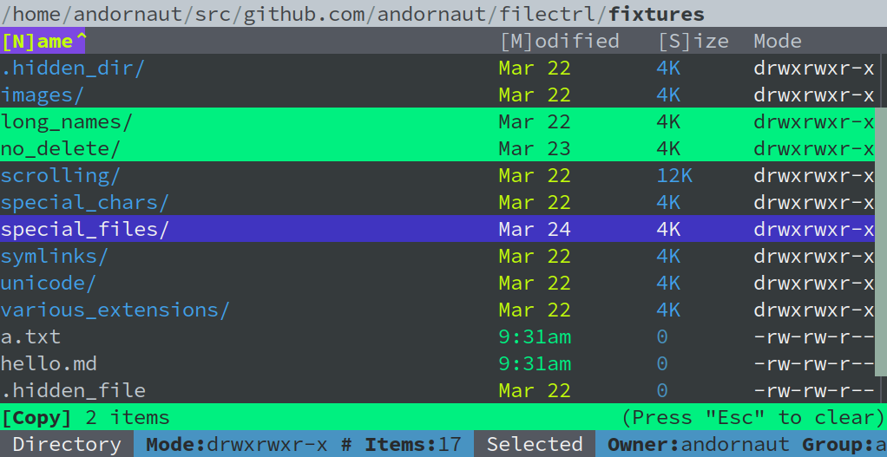
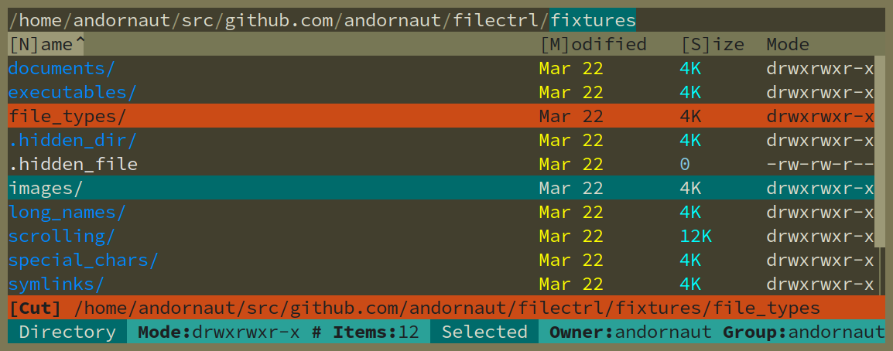

# FileCTRL

FileCTRL is a light, opinionated, responsive, theme-able, and simple Text User Interface (TUI) file manager for Linux and macOS

[](./screenshots/42KM.png)

## Features

- Simple interface with good defaults - works out of the box with [sensible settings](#configuration)
- [Bookmarks](#bookmarks) - save and quickly return to frequently-used folders
- [Customizable colors](#theming) - full truecolor and 256 color theme support with LS_COLORS integration
- [Rebindable keys](#customizing-keybindings) - customize all keybindings via TOML config
- [Vim-like navigation](#default-keybindings) and [multi-select](#multi-select) - hjkl movement, marks, range mode
- File operations: chmod, create directory, and [copy/cut/paste across instances/windows](#copy--paste)
- "Go to" feature with path completion suggestions
- Recursive search
- Responsive layout: adapts columns and content to small and large terminal windows

## Installation

You can [download and install a pre-built binary](https://github.com/andornaut/filectrl/releases) for Linux or macOS:

```bash
curl -sL https://github.com/andornaut/filectrl/releases/latest/download/filectrl-linux -o filectrl
chmod +x filectrl
sudo mv filectrl /usr/local/bin/
```

On macOS, allow the _unsigned_ `filectrl` binary to be executed:

```bash
xattr -d com.apple.quarantine filectrl
```

## Building

1. `git clone` and `cd` into this repository
1. Run ```cargo build --release && sudo cp target/release/filectrl /usr/local/bin/```

## Usage

Run `filectrl --help` to view the available command line arguments and options:

```text
Usage: filectrl [-c <config>] [-i <include...>] [--write-default-config] [--write-default-themes] [--colors-256] [--keybindings] [--] [<directory>]

FileCTRL is a light, opinionated, responsive, theme-able, and simple Text User Interface (TUI) file manager for Linux and macOS

Positional Arguments:
  directory         path to a directory to navigate to

Options:
  -c, --config      path to a configuration file
  -i, --include     include a TOML file to merge on top of the config
                    (repeatable; later files take precedence)
  --write-default-config
                    write the default config to ~/.config/filectrl/config.toml,
                    then exit
  --write-default-themes
                    write default theme files to ~/.config/filectrl/, then exit
  --colors-256      force 256-color theme (disables truecolor detection)
  --keybindings     print the keybindings help, then exit
  --help, help      display usage information
```

### Bookmarks

Bookmarks are symlinks to folders, stored in a `bookmarks/` directory beside
the config file (e.g. `~/.config/filectrl/bookmarks/`).

- <kbd>B</kbd> adds a bookmark for the current directory. A prompt asks for
  the bookmark name, defaulting to the current directory's name. Names must be
  unique, cannot be empty, and cannot contain a path separator.
- <kbd>'</kbd> or <kbd>&#96;</kbd> shows all bookmarks in the table.
- Opening a bookmark navigates to the linked folder.
- Bookmarks can be renamed (<kbd>r</kbd>) or deleted (<kbd>d</kbd>)

### Copy / paste

When you copy/cut a file or directory, FileCTRL puts `${operation} ${path}` into your clipboard buffer
(where `operation` is "cp" or "mv").
If you then paste into a second FileCTRL window, this second instance of FileCTRL will perform the equivalent of:
`${operation} ${path} ${current_directory}`, e.g. `cp filectrl.desktop ~/.local/share/applications/`.
Under the hood, FileCTRL doesn't actually invoke `cp` or `mv`, but implements similar operations using the Rust standard library.

### Multi-select

Mark files to apply bulk operations (chmod, copy, cut, delete) to multiple items at once.

- <kbd>v</kbd> toggles a mark on the current item
- <kbd>V</kbd> enters **range mode**: the current row becomes the anchor, and moving the cursor (arrow keys or clicking) extends the marked range from the anchor to the cursor
- Press <kbd>V</kbd> again to exit range mode (marks are kept)
- While marks exist, clicking an unmarked row adds it to the marks; clicking a marked row removes it
- In range mode, clicking always extends the range from the anchor to the clicked row
- <kbd>Esc</kbd> clears all marks and exits range mode
- Marks and clipboard are mutually exclusive -marking clears the clipboard

### Default keybindings

All keybindings can be [customized](#customizing-keybindings).

_**Normal mode**_

Actions | Keys
--- | ---
Select next, previous row | <kbd>↓</kbd>/<kbd>j</kbd>, <kbd>↑</kbd>/<kbd>k</kbd>
Select first, middle, last row | <kbd>Home</kbd>/<kbd>g</kbd>/<kbd>^</kbd>, <kbd>z</kbd>, <kbd>End</kbd>/<kbd>G</kbd> (Uppercase)/<kbd>$</kbd>
Select top, middle, bottom visible row | <kbd>H</kbd> (Uppercase), <kbd>M</kbd> (Uppercase), <kbd>L</kbd> (Uppercase)
Page down, up | <kbd>Ctrl</kbd>+<kbd>d</kbd>/<kbd>Ctrl</kbd>+<kbd>f</kbd>/<kbd>PgDn</kbd>, <kbd>Ctrl</kbd>+<kbd>u</kbd>/<kbd>Ctrl</kbd>+<kbd>b</kbd>/<kbd>PgUp</kbd>
Go to parent dir | <kbd>←</kbd>/<kbd>h</kbd>/<kbd>b</kbd>/<kbd>Backspace</kbd>
Go to previous dir | <kbd>-</kbd>
Go to home dir | <kbd>~</kbd>
Go to path | <kbd>:</kbd>/<kbd>Tab</kbd>
Open | <kbd>→</kbd>/<kbd>l</kbd>/<kbd>Enter</kbd>
Open current directory | <kbd>o</kbd>/<kbd>t</kbd>
Open new window | <kbd>w</kbd>
Mark/unmark item | <kbd>v</kbd>/<kbd>Space</kbd>
Range mark | <kbd>V</kbd> (Uppercase)
Copy, Cut, Paste | <kbd>y</kbd>/<kbd>Ctrl</kbd>+<kbd>c</kbd>, <kbd>x</kbd>/<kbd>Ctrl</kbd>+<kbd>x</kbd>, <kbd>p</kbd>/<kbd>Ctrl</kbd>+<kbd>v</kbd>
Rename | <kbd>r</kbd>/<kbd>F2</kbd>
Chmod (octal) | <kbd>P</kbd> (Uppercase)
Create directory | <kbd>c</kbd>
Delete | <kbd>d</kbd>/<kbd>Delete</kbd>
Filter | <kbd>f</kbd>/<kbd>\</kbd>
Search | <kbd>/</kbd>
Add bookmark | <kbd>B</kbd> (Uppercase)
Show bookmarks | <kbd>'</kbd>/<kbd>&#96;</kbd>
Refresh | <kbd>Ctrl</kbd>+<kbd>r</kbd>/<kbd>F5</kbd>
Sort by name, modified, size | <kbd>n</kbd>, <kbd>m</kbd>, <kbd>s</kbd>
Toggle show hidden files | <kbd>.</kbd>
Cancel file or search operations | <kbd>K</kbd> (Uppercase)
Clear alerts, progress | <kbd>Ctrl</kbd>+<kbd>a</kbd>, <kbd>Ctrl</kbd>+<kbd>p</kbd>
Clear clipboard/filter/marks/search, exit bookmarks view | <kbd>Esc</kbd>
Toggle help | <kbd>?</kbd>
Quit | <kbd>q</kbd>

_**Prompt mode**_

Actions | Keys
--- | ---
Submit | <kbd>Enter</kbd>
Cancel | <kbd>Esc</kbd>
Reset to initial value | <kbd>Ctrl</kbd>+<kbd>u</kbd>/<kbd>Ctrl</kbd>+<kbd>z</kbd>
Select all | <kbd>Ctrl</kbd>+<kbd>a</kbd>
Copy, Cut, Paste text | <kbd>Ctrl</kbd>+<kbd>c</kbd>, <kbd>Ctrl</kbd>+<kbd>x</kbd>, <kbd>Ctrl</kbd>+<kbd>v</kbd>
Move cursor | <kbd>←</kbd>/<kbd>→</kbd>
Move cursor by word | <kbd>Ctrl</kbd>+<kbd>←</kbd>/<kbd>→</kbd>
Move cursor to start, end | <kbd>Ctrl</kbd>+<kbd>a</kbd>/<kbd>Home</kbd>, <kbd>Ctrl</kbd>+<kbd>e</kbd>/<kbd>End</kbd>
Select text | <kbd>Shift</kbd>+<kbd>←</kbd>/<kbd>→</kbd>
Select to line start, end | <kbd>Shift</kbd>+<kbd>Home</kbd>, <kbd>Shift</kbd>+<kbd>End</kbd>
Select by word | <kbd>Ctrl</kbd>+<kbd>Shift</kbd>+<kbd>←</kbd>/<kbd>→</kbd>
Delete before, after cursor | <kbd>Backspace</kbd>, <kbd>Delete</kbd>
Accept path suggestion | <kbd>Tab</kbd>
Cycle path suggestions | <kbd>↓</kbd>/<kbd>↑</kbd>

> [!NOTE]
> <kbd>Ctrl</kbd>+<kbd>Shift</kbd> keybindings require a terminal that supports the [kitty keyboard protocol](https://sw.kovidgoyal.net/kitty/keyboard-protocol/) (e.g. Alacritty). tmux users must also add the following to `~/.tmux.conf`:
>
> ```conf
> set -g extended-keys on
> set -ga terminal-features ",*:extkeys"
> ```

## Configuration

The configuration is drawn from the first of the following:

1. The path specified by the command line option: `--config`
1. The default path, if it exists: `~/.config/filectrl/config.toml`
1. The built-in [default configuration](./src/app/config/default_config.toml)

Run `filectrl --write-default-config` to write the [default configuration](./src/app/config/default_config.toml) to `~/.config/filectrl/config.toml`.

You can also override only the properties you want to change:

```bash
cat ~/.config/filectrl/config.toml
[openers.linux]
open_current_directory = "alacritty --working-directory %s"
open_new_window = "alacritty --command filectrl %s"
```

The configuration is validated strictly: an unrecognized key (for example a misspelled setting or theme property), an unknown modifier name, or an invalid value (such as `buffer_min_bytes` exceeding `buffer_max_bytes`) causes FileCTRL to exit with an error rather than silently ignoring it.

### Opening in other applications

- [andornaut@github /til/ubuntu#default-applications](https://github.com/andornaut/til/blob/master/docs/ubuntu.md#default-applications)
- [XDG MIME Applications](https://wiki.archlinux.org/title/XDG_MIME_Applications)

Keyboard key | Description
--- | ---
<kbd>l</kbd> | Open the selected file using the program configured by: `openers.open_selected_file`
<kbd>o</kbd>/<kbd>t</kbd> | Open the current directory in the program configured by: `openers.open_current_directory`
<kbd>w</kbd> | Open a new `filectrl` window in the terminal configured by: `openers.open_new_window`

```toml
# Use [openers.linux] on Linux, or [openers.macos] on macOS.
# %s is replaced by the relevant path at runtime.
[openers.linux]
# %s will be replaced by the path to the current working directory:
open_current_directory = "alacritty --working-directory %s"
open_new_window = "alacritty --command filectrl %s"
# %s will be replaced by the path to the selected file or directory:
open_selected_file = "pcmanfm %s"

[openers.macos]
open_current_directory = "open %s"
open_new_window = "open -a Terminal %s"
open_selected_file = "open %s"
```

### Theming

FileCTRL supports two theme sections: `[theme]` for truecolor terminals and `[theme256]` for 256-color terminals. At startup, FileCTRL detects truecolor support via the `$COLORTERM` environment variable. Use `--colors-256` to force the 256 color theme.

#### Style properties

Each theme entry is a style with three optional properties:

Property | Format | Default | Description
--- | --- | --- | ---
`fg` | Color string | Inherited | Foreground color
`bg` | Color string | Inherited | Background color
`modifiers` | Array of strings | `[]` | Text modifiers

All properties are optional. Omit any property to use its default. Set `fg` or `bg` to `""` to explicitly inherit the parent widget's color.

**Color formats:**

- **Truecolor** (`[theme]`): hex strings like `"#FF0000"`, or named colors like `"Red"`
- **256 color** (`[theme256]`): decimal indexes `"0"` through `"255"`

**Available modifiers:** `"bold"`, `"dim"`, `"italic"`, `"underlined"`, `"blink"`, `"rapid_blink"`, `"reversed"`, `"crossed_out"`

#### Example: minimal custom theme

You only need to specify the properties you want to change:

```toml
[theme.table.selected]
bg = "#1A1A2E"

[theme.file_type.directory]
fg = "#E94560"
modifiers = ["bold"]
```

#### Theme sections

Section | Description
--- | ---
`[theme]` / `[theme256]` | Base foreground, background, and modifiers
`alert` | Alert bar (`base`, `error`, `info`, `warn`)
`breadcrumbs` | Path breadcrumbs (`base`, `ancestor`, `basename`, `separator`)
`clipboard` | Clipboard status indicators (`copy`, `cut`, `delete`)
`file_modified_date` | Date column colors by age (`less_than_minute`, `less_than_hour`, `less_than_day`, `less_than_month`, `less_than_year`, `greater_than_year`)
`file_size` | Size column colors by magnitude (`bytes`, `kib`, `mib`, `gib`, `tib`, `pib`)
`file_type` | Row colors by file type (`directory`, `executable`, `symlink`, `regular_file`, etc.)
`help` | Help panel (`base`, `header`, `actions`, `shortcuts`)
`notice` | Notice bar (`filter`, `progress`)
`prompt` | Input prompt (`cursor`, `input`, `label`, `selected`)
`scrollbar` | Scrollbar (`ends`, `thumb`, `track`, plus `show_ends` boolean)
`status` | Status bar (`detail`, `label`)
`table` | File table (`body`, `header`, `header_sorted`, `selected`, `marked`, `delete`, `bookmark`)

#### LS_COLORS integration

The `file_type` section has a `ls_colors_take_precedence` boolean. When `true`, colors from the `$LS_COLORS` environment variable are applied on top of the configured file type colors, including extension-based patterns (e.g. `*.tar=01;31`).

```toml
[theme.file_type]
ls_colors_take_precedence = true
```

#### External theme files

You can split themes into separate files using `include_files`:

```toml
include_files = ["my-theme.toml"]
```

- **Relative paths** are resolved from the directory containing the config file (e.g. `~/.config/filectrl/`)
- **Absolute paths** are used as-is
- Included files are **merged on top** of the base config - keys in included files override the base
- Multiple files are merged in order; later files override earlier ones
- If a file doesn't exist or can't be parsed, FileCTRL exits with an error

To get started with custom themes, export the built-in defaults as standalone files:

```bash
filectrl --write-default-themes
# Creates:
#   ~/.config/filectrl/theme.toml
```

Then copy, rename, and edit them:

```bash
cp ~/.config/filectrl/theme.toml ~/.config/filectrl/solarized.toml
vim ~/.config/filectrl/solarized.toml
```

And include the new file in your config:

```toml
include_files = ["solarized.toml"]
```

Alternatively, use the `--include` CLI flag to apply a theme without editing your config:

```bash
filectrl --include ~/.config/filectrl/solarized.toml
```

The flag is repeatable and files are merged in order (later files take precedence):

```bash
filectrl -i base-theme.toml -i overrides.toml
```

#### Bundled themes

FileCTRL includes the following themes in the [`themes/`](themes/) directory:

Theme | Inspired by | Screenshot
----- | ----------- | ----------
[IBM1970](./themes/ibm1970.toml) (default) | [vscode-ibm1970-theme](https://github.com/andornaut/vscode-ibm1970-theme) | [](./screenshots/IBM1970.png)
[42KM](./themes/42km.toml) | [vscode-42km-theme](https://github.com/andornaut/vscode-42km-theme) | [](./screenshots/42KM.png)

```bash
filectrl --include themes/42km.toml
```

### Customizing keybindings

Keybindings are configured in the `[keybindings]` section of `config.toml`. Edit the values to change any binding. Values can be a single key string or an array of key strings.

Arrow keys, <kbd>Home</kbd>/<kbd>End</kbd>, <kbd>PageUp</kbd>/<kbd>PageDown</kbd>, and <kbd>Esc</kbd> are hardcoded and always work in addition to any configured keys.

```toml
[keybindings]
# Normal mode
quit = "q"
toggle_help = "?"
...
# Prompt mode
prompt_submit = "Enter"
prompt_reset = ["Ctrl+u", "Ctrl+z"]
...
```

Key strings support:

- Single characters: `"q"`, `"/"`, `"~"`, `"^"`, `"$"`
- Uppercase characters (implies Shift): `"G"`, `"V"`, `"N"`
- Named keys: `"Enter"`, `"Esc"`, `"Backspace"`, `"Delete"`, `"Space"`, `"Tab"`, `"Up"`, `"Down"`, `"Left"`, `"Right"`, `"Home"`, `"End"`, `"PgUp"`, `"PgDn"`
- Function keys: `"F2"`, `"F5"`
- Modifier prefixes: `"Ctrl+c"`, `"Shift+Left"`, `"Ctrl+Shift+a"`

Duplicate keybindings (the same key assigned to two different actions within the same mode) are detected at startup and cause an error.

The help view (<kbd>?</kbd>) always reflects the currently configured keybindings.

### Desktop entry

- ["Desktop Entry" specification](https://specifications.freedesktop.org/desktop-entry-spec/desktop-entry-spec-latest.html)

You can make `filectrl` the default application for opening directories. Start by copying the [`filectrl.desktop` file](./filectrl.desktop) to `~/.local/share/applications/`:

```bash
cp filectrl.desktop ~/.local/share/applications/
xdg-mime default filectrl.desktop inode/directory
update-desktop-database ~/.local/share/applications/
```

## Developing

- [andornaut@github /til/rust](https://github.com/andornaut/til/blob/master/docs/rust.md)
- See [Cargo.toml](./Cargo.toml) for dependencies.
- [Download files and folders of various types to test colors](https://github.com/seebi/dircolors-solarized/raw/refs/heads/master/test-directory.tar.bz2)

The [`fixtures/`](./fixtures/) directory contains a committed file tree for manual UI testing. Navigate into it with `cargo run` to exercise rendering edge cases:

- **`file_dates/`** - files with mtimes in each date-colour bucket (< 1 min, < 1 hour, < 1 day, < 1 month, < 1 year, > 1 year)
- **`file_sizes/`** - sparse files covering every size-colour bucket (bytes → GiB)
- **`file_types/`** - named pipe, symlinks, executable, and directory permission variants (other-writable, sticky)
- **`no_delete/`** - read-only parent directory (`chmod 555`); navigate here to trigger delete/rename permission errors
- **`scrolling/`** - 53 entries with long filenames interspersed to exercise scrolling and multi-row truncation
- Plus: executables, symlinks, hidden files, Unicode names, special characters, and long filenames

```bash
cargo clippy
cargo fix --allow-dirty --allow-staged
cargo test
cargo run
cargo build --release
./target/release/filectrl
sudo cp ./target/release/filectrl /usr/local/bin/

# Log to ./err
RUST_LOG=debug,notify=info cargo run -- fixtures/ 2>err
```

### Git hooks

- [cargo-husky](https://github.com/rhysd/cargo-husky)

[Changing cargo-husky configuration](https://github.com/rhysd/cargo-husky/issues/30):

1. Edit the `[dev-dependencies.cargo-husky]` section of [Cargo.toml](./Cargo.toml)
1. `rm .git/hooks/pre-commit` (or other hook file)
1. `cargo clean`
1. `cargo test`
1. Verify that the changes have been applied to `.git/hooks/pre-commit`

### Releasing

The project uses GitHub Actions to automate the release process. To release a new version:

1. Ensure you are on the `main` branch and have pulled the latest changes.
2. Create and push a new semantic version tag:

   ```bash
   git tag -a v1.0.0 -m "Release v1.0.0"
   git push origin v1.0.0
   ```

3. The GitHub Actions [release workflow](.github/workflows/release.yml) will automatically trigger, build the binaries for Linux and macOS, and create a new GitHub Release with the artifacts.
