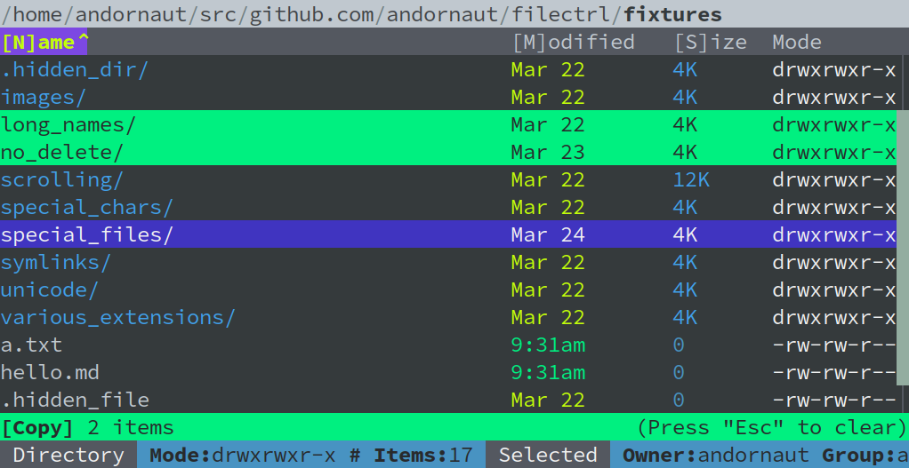
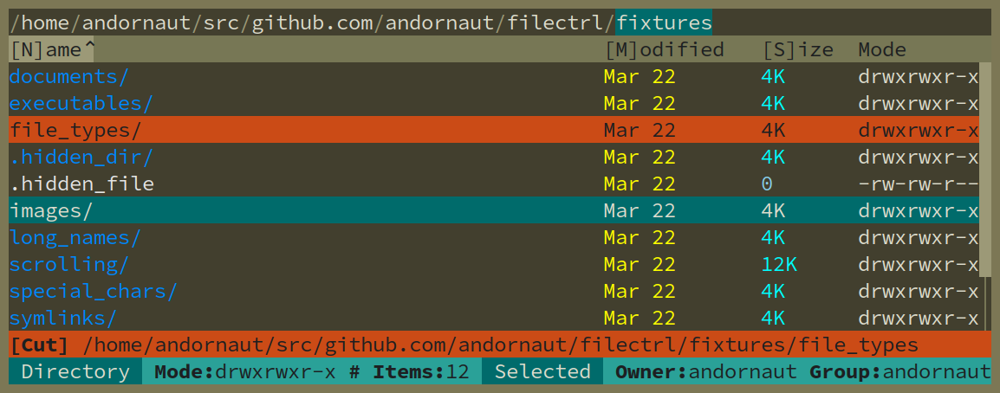

# FileCTRL

[](https://github.com/andornaut/filectrl/actions/workflows/release.yml)
[](https://opensource.org/license/MIT)

FileCTRL is a light, opinionated, responsive, theme-able, and simple Text User Interface (TUI) file manager for Linux and macOS

[](./screenshots/42KM.png)

## Features

- Simple interface with [sensible defaults](#configuration)
- [Bookmarks](#bookmarks): save and return to frequently-used folders
- [Customizable colors](#theming): truecolor and 256 color themes, with `LS_COLORS` integration
- [Rebindable keys](#customizing-keybindings) via TOML config
- [Vim-like navigation](#default-keybindings) and [multi-select](#multi-select): hjkl movement, marks, range mode
- File operations: chmod, create directory, and [copy/cut/paste across windows](#copy--paste)
- "Go to" with path completion
- [Filtering](#filtering), [searching](#searching), and [sorting](#sorting)
- Responsive layout: adapts columns and content to the terminal size

## Installation

[Download a pre-built binary](https://github.com/andornaut/filectrl/releases). Each release publishes `filectrl_{system}_{arch}.tar.gz` and a `.sha256` checksum for `linux_x86_64`, `linux_arm64`, and `darwin_arm64` (macOS is Apple Silicon only).

```bash
curl -sL https://github.com/andornaut/filectrl/releases/latest/download/filectrl_linux_x86_64.tar.gz | tar -xz filectrl
sudo mv filectrl /usr/local/bin/
```

The archives also contain `LICENSE` and `README.md`; `tar -xz filectrl` extracts only the binary.

On macOS, allow the _unsigned_ binary to run:

```bash
xattr -d com.apple.quarantine filectrl
```

## Building

```bash
cargo build --release && sudo cp target/release/filectrl /usr/local/bin/
```

## Usage

```bash
filectrl [OPTIONS] [DIRECTORY]
```

Option | Description
--- | ---
`-c`, `--config <PATH>` | Read the config from `PATH`, or write it there when combined with a `--write-default-*` flag
`-i`, `--include <PATH>` | Merge a TOML file on top of the config. Repeatable; later files take precedence
`--no-truecolor` | Use the 256-color theme instead of detecting truecolor support
`--force` | Replace an existing file when writing defaults, which fails without it. A symlink is refused even with `--force`, so a config linked into a dotfiles repository is left alone
`--print-keybindings` | Print the keybindings, then exit
`--write-default-config` | Write the default config, then exit
`--write-default-themes` | Write the default theme as `theme.toml` beside the config, then exit
`-V`, `--version` | Print the version, then exit
`-h`, `--help` | Print usage, then exit

The four flags below act and exit. They are mutually exclusive, and each accepts only the arguments that change what it does:

Flag | Also accepts
--- | ---
`--print-keybindings` | `--config`, `--include`
`--write-default-config` | `--config`, `--force`
`--write-default-themes` | `--config`, `--force`
`--version` | nothing

Anything else is reported rather than ignored. Both write flags print the path they wrote, which follows `$XDG_CONFIG_HOME` and so is not always under `~/.config`.

SIGTERM, SIGINT, SIGHUP, SIGQUIT, SIGUSR1, SIGUSR2 and SIGALRM restore the terminal and exit. SIGTSTP is ignored, since a stopped process would leave the terminal in raw mode.

### Bookmarks

Bookmarks are symlinks to folders, stored in a `bookmarks/` directory beside the config file (e.g. `~/.config/filectrl/bookmarks/`).

Key | Action
--- | ---
<kbd>B</kbd> | Bookmark the current directory. The prompt defaults to the directory's name
<kbd>'</kbd> or <kbd>&#96;</kbd> | Show all bookmarks in the table
<kbd>Enter</kbd> | Navigate to the linked folder
<kbd>r</kbd>, <kbd>d</kbd> | Rename or delete the bookmark

Names must be unique, cannot be empty, and cannot contain a path separator.

### Copy / paste

Copying or cutting puts `${operation} ${path}` on the system clipboard, where `operation` is `cp` or `mv`. Pasting in another FileCTRL window performs the equivalent of `${operation} ${path} ${current_directory}`, e.g. `cp filectrl.desktop ~/.local/share/applications/`. Clipboard text is pasted only when every path in it is absolute, so a shell line such as `cp build dist` copied from elsewhere is ignored. An entry the pasting window did not write itself, including one from another FileCTRL window, asks for confirmation first (<kbd>y</kbd> pastes, any other key cancels), since any program can put such text on the clipboard. The confirmation shows each path in full, and an entry from elsewhere with a `.` or `..` component in a path is refused.

A paste copies the way `cp -R` does without `-p`: the umask applies to each entry's mode, and the setuid, setgid and sticky bits are dropped. A cut that crosses filesystems copies and then removes the original, the way `mv` does: it keeps the modes, the timestamps, and the group when you belong to it (setuid and setgid only when the copy has the original's owner and group). Like `mv`, it removes the whole original once every entry is copied, so something written into the original while the copy ran is removed with it, and from that point it can no longer be cancelled. An original that was replaced by another entry after the copy is kept, and the move reports it. Like `cp -R`, a directory the copy created and another process swapped for one of its own before it is filled is written into.

Without a system clipboard (e.g. over SSH or on a bare console), copy and paste still work within a single window. Pasting with nothing to paste and no system clipboard to read shows a warning, since an entry copied in another window would be unreachable.

When the destination already contains an entry with the same name, the paste stops and asks:

Key | Action
--- | ---
<kbd>s</kbd> | Skip this entry
<kbd>S</kbd> | Skip this entry and every later collision in the same paste
<kbd>o</kbd> | Replace the existing entry
<kbd>O</kbd> | Replace this and every later collision in the same paste
<kbd>Esc</kbd> | Abandon the rest of the paste

- An existing **directory** is never replaced, so only the skip choices are offered for one. Modifier chords are not choices: <kbd>Ctrl</kbd>+<kbd>o</kbd> abandons the paste.
- <kbd>S</kbd> and <kbd>O</kbd> also cover copies already running: if another program takes a name inside a directory being copied, the standing answer settles it without stopping the copy. Only <kbd>S</kbd> settles a directory. Anything left unsettled is reported when the copy finishes.
- A cut that skipped an entry keeps its original: the skipped entry is not at the destination, so removing the source would take the only copy of it.
- Whatever is not pasted (collisions you abandon, entries that failed) stays on the clipboard, so pasting again retries exactly those. Entries you skip deliberately do not. If nothing was pasted at all, the clipboard is unchanged.

### Chmod

Chmod (<kbd>P</kbd>) never follows a symlink: a symlink is refused rather than having its target changed. Setting a mode without following links needs glibc 2.32 or newer, or `/proc` mounted; where neither holds (an old distribution, or a container without `/proc`), chmod fails with "Operation not supported".

### Entries that change after they are listed

Rename, chmod, delete, and the sources of a copy or cut act only on the entry that was listed. Each reads its path again first and refuses with "it changed since it was listed" when the path now names a different entry (another device or inode): the entry was replaced, or a directory above it was swapped for a symlink. A refresh of a directory that was itself replaced is refused the same way, since the marks would carry over by path to entries you never saw. The warning is shown once, and later refreshes stay silent until you navigate; navigate to it again to list the new one.

On Linux, FUSE (sshfs, GNOME's gvfs) and SMB/CIFS mounts can give an entry nobody touched a new inode number, so there only the device is compared: a swap within the same mount is not detected.

### Multi-select

Mark entries to apply chmod, copy, cut, or delete to several at once.

Key | Action
--- | ---
<kbd>v</kbd>/<kbd>Space</kbd> | Toggle a mark on the current row
<kbd>V</kbd> | Enter range mode: the current row becomes the anchor. Press again to exit, keeping the marks
<kbd>Esc</kbd> | Clear all marks and exit range mode

In range mode, moving the cursor or clicking extends the marked range from the anchor to the cursor. Marks made before entering range mode are kept, so ranges and single marks combine. Outside range mode, clicking only moves the cursor. Marking clears the clipboard.

Marks name entries but are stored as row positions, so what becomes of them depends on why the listing changed:

Change | Marks
--- | ---
Sorting, filtering, toggling hidden files | Cleared
Starting a search | Cleared
Reload (<kbd>Ctrl</kbd>+<kbd>r</kbd> or a watcher refresh) | Kept, re-found by path. An entry that is gone loses its mark
A search finishing or being cancelled | Kept
Navigating to another directory | Cleared
Copying or cutting | Kept, so what is on the clipboard stays marked
chmod, delete, or pasting | Consumed by the operation

### Filtering

The filter (<kbd>f</kbd>/<kbd>&#92;</kbd>) is a case-insensitive substring match against the Name column, so it matches what is on screen: the entry's own name in a normal listing, the path relative to the search root while searching, and the bookmark name in the bookmarks view.

Directories carry a trailing `/` outside the bookmarks view, so `/` filters a listing down to directories, and `docs/` matches both the `docs` directory and, in search results, everything under it.

### Searching

Search (<kbd>/</kbd>) walks the current directory recursively, matching a case-insensitive substring against each entry's name. Symlinked directories are not descended into. `search_max_depth` and `search_max_results` in `[file_system]` bound the walk; on reaching either, FileCTRL keeps the results it has and says so.

Results appear as the walk finds them and settle into the sort order once it ends, whether it finished or was cancelled.

### Sorting

<kbd>n</kbd>/<kbd>m</kbd>/<kbd>s</kbd> sort by name, modified time, or size; clicking a column header does the same. Sorting by the same column again reverses it. Each column starts in the direction it is usually reached for:

Column | Default direction
--- | ---
Name | A-Z
Modified | Newest first
Size | Largest first

The Name column orders by the text it displays (while searching, the path relative to the search root), ignoring case and a leading dot on each path segment, so a dot file sorts next to its neighbours the way `ls -a` does. `sort_directories_first` in the `[ui]` section groups directories first, for the Name column only.

### Default keybindings

All keybindings can be [customized](#customizing-keybindings).

_**Normal mode**_

Actions | Keys
--- | ---
Select next, previous row | <kbd>↓</kbd>/<kbd>j</kbd>, <kbd>↑</kbd>/<kbd>k</kbd>
Select first, middle, last row | <kbd>Home</kbd>/<kbd>g</kbd>/<kbd>^</kbd>, <kbd>z</kbd>, <kbd>End</kbd>/<kbd>G</kbd> (Uppercase)/<kbd>$</kbd>
Select top, middle, bottom visible row | <kbd>H</kbd> (Uppercase), <kbd>M</kbd> (Uppercase), <kbd>L</kbd> (Uppercase)
Page down, up | <kbd>PgDn</kbd>/<kbd>Ctrl</kbd>+<kbd>d</kbd>/<kbd>Ctrl</kbd>+<kbd>f</kbd>, <kbd>PgUp</kbd>/<kbd>Ctrl</kbd>+<kbd>u</kbd>/<kbd>Ctrl</kbd>+<kbd>b</kbd>
Go to parent dir | <kbd>←</kbd>/<kbd>h</kbd>/<kbd>b</kbd>/<kbd>Backspace</kbd>
Go to previous dir | <kbd>-</kbd>
Go to home dir | <kbd>~</kbd>
Go to path | <kbd>:</kbd>/<kbd>Tab</kbd>
Open | <kbd>→</kbd>/<kbd>l</kbd>/<kbd>Enter</kbd>
Open current directory | <kbd>t</kbd>
Open new window | <kbd>w</kbd>
Open with... | <kbd>o</kbd>
Mark/unmark item | <kbd>v</kbd>/<kbd>Space</kbd>
Range mark | <kbd>V</kbd> (Uppercase)
Copy, Cut, Paste | <kbd>y</kbd>/<kbd>Ctrl</kbd>+<kbd>c</kbd>, <kbd>x</kbd>/<kbd>Ctrl</kbd>+<kbd>x</kbd>, <kbd>p</kbd>/<kbd>Ctrl</kbd>+<kbd>v</kbd>
Rename | <kbd>r</kbd>/<kbd>F2</kbd>
Chmod (octal) | <kbd>P</kbd> (Uppercase)
Create directory | <kbd>c</kbd>
Delete | <kbd>d</kbd>/<kbd>Delete</kbd>
Filter | <kbd>f</kbd>/<kbd>&#92;</kbd>
Search | <kbd>/</kbd>
Add bookmark | <kbd>B</kbd> (Uppercase)
Show bookmarks | <kbd>'</kbd>/<kbd>&#96;</kbd>
Refresh | <kbd>Ctrl</kbd>+<kbd>r</kbd>/<kbd>F5</kbd>
Sort by name, modified, size | <kbd>n</kbd>, <kbd>m</kbd>, <kbd>s</kbd>
Toggle show hidden files | <kbd>.</kbd>
Cancel file or search operations | <kbd>K</kbd> (Uppercase)
Clear alerts, progress | <kbd>Ctrl</kbd>+<kbd>a</kbd>, <kbd>Ctrl</kbd>+<kbd>p</kbd>
Clear clipboard/filter/marks/search, exit bookmarks view | <kbd>Esc</kbd>
Toggle help | <kbd>?</kbd>
Quit | <kbd>q</kbd>

_**Prompt mode**_

Actions | Keys
--- | ---
Submit | <kbd>Enter</kbd>
Cancel | <kbd>Esc</kbd>
Reset to initial value | <kbd>Ctrl</kbd>+<kbd>u</kbd>/<kbd>Ctrl</kbd>+<kbd>z</kbd>
Select all | <kbd>Ctrl</kbd>+<kbd>a</kbd>
Copy, Cut, Paste text | <kbd>Ctrl</kbd>+<kbd>c</kbd>, <kbd>Ctrl</kbd>+<kbd>x</kbd>, <kbd>Ctrl</kbd>+<kbd>v</kbd>
Move cursor | <kbd>←</kbd>/<kbd>→</kbd>
Move cursor by word | <kbd>Ctrl</kbd>+<kbd>←</kbd>/<kbd>→</kbd>
Move cursor to start, end | <kbd>Home</kbd>, <kbd>Ctrl</kbd>+<kbd>e</kbd>/<kbd>End</kbd>
Select text | <kbd>Shift</kbd>+<kbd>←</kbd>/<kbd>→</kbd>
Select to line start, end | <kbd>Shift</kbd>+<kbd>Home</kbd>, <kbd>Shift</kbd>+<kbd>End</kbd>
Select by word | <kbd>Ctrl</kbd>+<kbd>Shift</kbd>+<kbd>←</kbd>/<kbd>→</kbd>
Delete before, after cursor | <kbd>Backspace</kbd>, <kbd>Delete</kbd>
Accept path suggestion (cursor at end of input) | <kbd>Tab</kbd>
Cycle path suggestions (cursor at end of input) | <kbd>↓</kbd>/<kbd>↑</kbd>

A suggestion is shown with its position as `(N of M)`, and cycling wraps in both directions. Moving the cursor off the end of the input dismisses it. A directory of more than 10,000 entries offers no suggestions.

Text pasted through the terminal (bracketed paste) goes into a text prompt as one line, with its line breaks removed. A paste anywhere else, including a y/n prompt, is ignored, so pasted text never acts as keys.

> [!NOTE]
> <kbd>Ctrl</kbd>+<kbd>Shift</kbd> with a letter (a `"Ctrl+Shift+a"` binding, say) requires a terminal that supports the [kitty keyboard protocol](https://sw.kovidgoyal.net/kitty/keyboard-protocol/) (e.g. Alacritty): the legacy encoding sends one byte for both <kbd>Ctrl</kbd>+<kbd>a</kbd> and <kbd>Ctrl</kbd>+<kbd>Shift</kbd>+<kbd>a</kbd>, so the Shift cannot survive it. <kbd>Ctrl</kbd>+<kbd>Shift</kbd> with an arrow key does not need the protocol, because the legacy encoding does carry modifiers for arrows.
>
> Under tmux, add the following to `~/.tmux.conf` as well:
>
> ```conf
> set -g extended-keys on
> set -ga terminal-features ",*:extkeys"
> ```

## Configuration

The built-in [default configuration](./src/app/config/default_config.toml) is always the base. A config file merges on top of it, read from the first of:

1. The path given by `--config`
1. `~/.config/filectrl/config.toml`, if it exists

`--config` replaces the user config rather than adding to it, so a key the given file leaves out falls back to the built-in default, not to `~/.config/filectrl/config.toml`.

`filectrl --write-default-config` writes the defaults to whichever of those two paths applies. It writes the configuration keys only; the theme keys are a separate file written by `--write-default-themes`.

Override only what you want to change:

```toml
# ~/.config/filectrl/config.toml
log_level = "warn"

[ui]
show_hidden_files = false
sort_directories_first = false
```

Validation is strict: an unrecognized key (a misspelled setting or theme property), an unknown modifier name, or an invalid value (such as `buffer_min_bytes` exceeding `buffer_max_bytes`) makes FileCTRL exit with an error rather than ignore it.

### Opening in other applications

- [andornaut@github /til/ubuntu#default-applications](https://github.com/andornaut/til/blob/main/docs/ubuntu.md#default-applications)
- [XDG MIME Applications](https://wiki.archlinux.org/title/XDG_MIME_Applications)

Key | Opens with
--- | ---
<kbd>l</kbd> | `openers.open_file`
<kbd>t</kbd> | `openers.open_directory`, for the current directory
<kbd>w</kbd> | `openers.open_filectrl_window`, a new `filectrl` window
<kbd>o</kbd> | A picker of the applications that can open the selection

Each template runs with `sh -c`. The path is never written into the command: `%s` becomes a reference to it (`"$1"`), and the path is passed to the shell as an argument, so the shell expands it but never parses it. A file name therefore cannot run as a command wherever `%s` sits, quoted or not. Only a template that hands the text to another parser can still run it: `eval`, a nested `sh -c`, `ssh`, or bash arithmetic such as `$(( %s ))`.

```toml
# Use [openers.linux] on Linux, or [openers.macos] on macOS.
# %s stands for the current directory, the selected entry, or a new window's
# directory. In run_in_terminal alone it stands for a command, each word its
# own argument (see "Open with..." below).
[openers.linux]
open_directory = "alacritty --working-directory %s"
open_file = "pcmanfm %s"
open_filectrl_window = "alacritty --command filectrl %s"
run_in_terminal = "alacritty --command %s"

[openers.macos]
open_directory = "open %s"
open_file = "open %s"
open_filectrl_window = "osascript -e 'on run argv' -e 'tell application \"Terminal\" to activate' -e 'tell application \"Terminal\" to do script \"filectrl \" & quoted form of item 1 of argv' -e 'end run' %s"
run_in_terminal = "" # Linux only, ignored here
```

#### The "Open with" picker

<kbd>o</kbd> replaces the file table with the applications that can open the selection, leaving the breadcrumbs and status bar visible. The default application is listed first and marked `(default)`.

Key | Action
--- | ---
<kbd>↓</kbd>/<kbd>j</kbd>, <kbd>↑</kbd>/<kbd>k</kbd> | Move between applications
<kbd>→</kbd>/<kbd>l</kbd>/<kbd>Enter</kbd> | Open with the selected application
<kbd>1</kbd> to <kbd>9</kbd> | Open with that numbered application
<kbd>o</kbd> | Close the picker
<kbd>Esc</kbd> | Close the picker and reset the view (clears the clipboard, filter and marks, and leaves search or bookmarks)

Only the first nine rows have a number; scroll to reach the rest. Applications that share a name are collapsed to the best ranked one.

The list is built per platform:

- **Linux:** the MIME type is resolved through the shared MIME database, including its parent types, so a `.rs` file also offers plain text editors. It is then matched against `mimeapps.list` and the `.desktop` files under `$XDG_DATA_DIRS/applications`, per the [mime-apps spec](https://specifications.freedesktop.org/mime-apps/latest-single/). The application directories are indexed once per run, so an application installed while FileCTRL is open is not offered until the next start. An entry whose `Exec` could hand the file name to an interpreter as code is not offered either (see below), and the log names it at warn level. Relative directories in `$XDG_DATA_DIRS` and the other XDG variables are ignored, as the spec requires.
- **macOS:** Launch Services, which requires macOS 12 or newer. The chosen application is launched with `open -a`.

On Linux, a desktop entry's `Exec` is refused when a value could reach an interpreter as code. An option cluster is a single `-` followed only by letters and digits; one holding `c`, `e` or `S` (`-c`, `-lc`, `-cx`, `-e`, `-S`, `-verbose`) is taken to give code to run, whatever the program.

`Exec` shape | Example | Result
--- | --- | ---
Field code with no cluster before it | `mpv %f`, `mpv --file=%f`, `foo %f -c bar` | Offered
Quoted argument that is only the code | `app "%f"` | Offered
Code after a long option or a cluster without `c`, `e` or `S` | `foo --exec %f`, `foo -xvf %f` | Offered
`%i`, `%%` or a deprecated code after a cluster, with the file code before it | `foo %f -c %i` | Offered
Field code anywhere after a cluster, quoted or not | `sh -c %f`, `sh -c -x %f`, `perl -e %f`, `env -S %f` | Refused
No file code, so the appended path would follow a cluster | `sh -c`, `xterm -e htop` | Refused
Field code inside a quoted or escaped argument | `run --command "mpv %f"`, `app "--file=%f"` | Refused

The rule is deliberately broad and refuses some safe entries, such as `sh -c 'mpv "$1"' sh %f`, which passes the name to the script as a parameter. To open files through a shell command, use the `openers` templates above, which pass the path to the shell as an argument.

Two `openers` settings shape the list, and setting either to `""` drops its effect:

- Applications that need a terminal (`Terminal=true`) run inside `openers.run_in_terminal`, whose `%s` stands for the command, each word its own argument: `xterm -e %s` runs `xterm` with the arguments `-e`, `vim` and `/some file.txt`. The terminal must run the words after its option as a program and its arguments, as `xterm -e` and `alacritty --command` do. One that joins them into a string for a shell to parse again would run a file name as shell code.
- `openers.open_file` (or `openers.open_directory` for a directory) is offered last, showing its command template beside the setting name, so the picker still works with no application database. Without it, a path that matches nothing shows "No applications found".

### Theming

`[theme]` applies to truecolor terminals and `[theme256]` to 256-color terminals. FileCTRL detects truecolor support via `$COLORTERM`; `--no-truecolor` selects the 256-color theme regardless. There is no flag for the other direction: a terminal that supports truecolor but does not set `$COLORTERM` (common under tmux, and under some SSH and `sudo` sessions) gets the 256-color theme, so set the variable yourself with `COLORTERM=truecolor filectrl`.

#### Style properties

Each theme entry is a style. All three properties are optional; set `fg` or `bg` to `""` to inherit the parent widget's color.

Property | Format | Default
--- | --- | ---
`fg` | Color string | Inherited
`bg` | Color string | Inherited
`modifiers` | Array of strings | `[]`

- **Truecolor** (`[theme]`): hex strings like `"#FF0000"`, or named colors like `"Red"`
- **256 color** (`[theme256]`): decimal indexes `"0"` through `"255"`
- **Modifiers:** `"bold"`, `"dim"`, `"italic"`, `"underlined"`, `"blink"`, `"rapid_blink"`, `"reversed"`, `"crossed_out"`

```toml
[theme.table.selected]
bg = "#1A1A2E"

[theme.file_type.directory]
fg = "#E94560"
modifiers = ["bold"]
```

#### Theme sections

Section | Description
--- | ---
`[theme]` / `[theme256]` | Base foreground, background, and modifiers
`alert` | Alert bar (its own style, plus `error`, `info`, `warn`)
`breadcrumbs` | Path breadcrumbs (its own style, plus `ancestor`, `basename`, `bookmarks`, `search`, `separator`)
`clipboard` | Clipboard status indicators (`copy`, `cut`, `delete`)
`file_modified_date` | Date column by age (`less_than_minute`, `less_than_hour`, `less_than_day`, `less_than_month`, `less_than_year`, `greater_than_year`)
`file_size` | Size column by magnitude (`bytes`, `kib`, `mib`, `gib`, `tib`, `pib`)
`file_type` | Row colors by file type (`directory`, `executable`, `symlink`, `regular_file`, etc.)
`help` | Help panel (its own style, plus `header`, `actions`, `shortcuts`)
`notice` | Notice bar (`filter`, `progress`, `search`, `search_loading`)
`open_with` | Open with... picker (its own style, plus `detail`, `selected`, `shortcut`)
`prompt` | Input prompt (`cursor`, `delete`, `goto_suggestion`, `input`, `label`, `selected`)
`scrollbar` | Scrollbar (`ends`, `thumb`, `track`, plus `show_ends` boolean)
`status` | Status bar (`detail`, `label`)
`table` | File table (`body`, `header`, `header_sorted`, `selected`, `marked`, `delete`, `bookmark`)

#### LS_COLORS integration

With `ls_colors_take_precedence`, colors from `$LS_COLORS` are applied on top of the configured file type colors, including extension patterns such as `*.tar=01;31`.

```toml
[theme.file_type]
ls_colors_take_precedence = true
```

#### External theme files

`include_files` merges other TOML files on top of the config:

```toml
include_files = ["theme.toml"]
```

- Relative paths resolve from the directory containing the config file; absolute paths are used as-is
- Files merge in order, later ones taking precedence over the base config and over earlier files
- The value must be an array of strings, and every listed file must exist, be a regular file (or a symlink to one), and parse, or FileCTRL exits with an error. The same holds for the config file and for `--include`

Export the defaults, then copy and edit:

```bash
filectrl --write-default-themes  # writes ~/.config/filectrl/theme.toml
cp ~/.config/filectrl/theme.toml ~/.config/filectrl/solarized.toml
```

`--include`/`-i` applies a theme without editing the config. It is repeatable and merges in order, later ones taking precedence. Unlike `include_files`, relative paths resolve against the current directory:

```bash
filectrl -i ~/.config/filectrl/solarized.toml -i overrides.toml
```

#### Bundled themes

Theme | Inspired by | Screenshot
----- | ----------- | ----------
[IBM1970](./themes/ibm1970.toml) (default) | [vscode-ibm1970-theme](https://github.com/andornaut/vscode-ibm1970-theme) | [](./screenshots/IBM1970.png)
[42KM](./themes/42km.toml) | [vscode-42km-theme](https://github.com/andornaut/vscode-42km-theme) | [](./screenshots/42KM.png)

```bash
filectrl --include themes/42km.toml
```

### Customizing keybindings

Keybindings live in the `[keybindings]` section of `config.toml`. A value is a single key string or an array of them.

```toml
[keybindings]
# Normal mode
quit = "q"
toggle_help = "?"
...
# Prompt mode
prompt_submit = "Enter"
prompt_reset = ["Ctrl+u", "Ctrl+z"]
...
```

Key strings support:

Form | Examples
--- | ---
Single characters | `"q"`, `"/"`, `"~"`, `"^"`, `"$"`
Uppercase (implies Shift) | `"G"`, `"V"`, `"N"`
Named keys | `"Enter"`, `"Esc"`, `"Backspace"`, `"Delete"`, `"Space"`, `"Tab"`, `"BackTab"`, `"Up"`, `"Down"`, `"Left"`, `"Right"`, `"Home"`, `"End"`, `"PgUp"`, `"PgDn"`
Function keys | `"F2"`, `"F5"`
Modifier prefixes | `"Ctrl+c"`, `"Shift+Left"`, `"Ctrl+Shift+a"`

`"Shift+g"` is equivalent to `"G"`, and `"Shift+Tab"` to `"BackTab"`.

Binding one key to two actions in the same mode prevents startup, including a collision between a key you configured and a default you did not override. Assigning the same key to one action more than once is allowed.

Some keys are hardcoded and always work alongside any configured keys, scoped to their mode:

Mode | Hardcoded
--- | ---
Normal | Arrow keys, <kbd>Home</kbd>/<kbd>End</kbd>, <kbd>PageUp</kbd>/<kbd>PageDown</kbd>, <kbd>Esc</kbd>
Prompt | <kbd>Esc</kbd> (cancel), <kbd>Tab</kbd> (accept suggestion), <kbd>↓</kbd>/<kbd>↑</kbd> (cycle suggestions)

Because the scoping is per mode, <kbd>Tab</kbd> is still configurable in normal mode, where the default `goto` binding uses it. Binding a hardcoded key to a different action in the same mode prevents startup; binding it to its own action is allowed.

The help view (<kbd>?</kbd>) reflects the configured keybindings.

### Desktop entry

- ["Desktop Entry" specification](https://specifications.freedesktop.org/desktop-entry/desktop-entry-spec-latest.html)

To make `filectrl` the default application for opening directories:

```bash
cp filectrl.desktop ~/.local/share/applications/
xdg-mime default filectrl.desktop inode/directory
update-desktop-database ~/.local/share/applications/
```

## Developing

- [andornaut@github /til/rust](https://github.com/andornaut/til/blob/main/docs/rust.md)
- See [Cargo.toml](./Cargo.toml) for dependencies.
- [Download files and folders of various types to test colors](https://github.com/seebi/dircolors-solarized/raw/refs/heads/master/test-directory.tar.bz2)

```bash
# Run against a directory, logging to ./err
RUST_LOG=debug,notify=info cargo run -- fixtures/ 2>err

# Typecheck the macOS-only code without a Mac
rustup target add aarch64-apple-darwin
cargo check --target aarch64-apple-darwin
```

[`fixtures/`](./fixtures/) is a committed file tree for manual UI testing. Navigate into it with `cargo run` to exercise rendering edge cases:

Path | Covers
--- | ---
`file_types/` | Valid and broken symlinks, an executable, and a regular file
`no_delete/` | Delete and rename permission errors. Needs `chmod 555 fixtures/no_delete` first; git does not track the read-only bit
`scrolling/` | 48 entries with long filenames interspersed, for scrolling and multi-row truncation
Elsewhere | Executables, symlinks, hidden files, Unicode names, special characters, long filenames

Some cases need fixtures git cannot store; create them locally:

- Date-color and size-color buckets (mtimes, sparse files): `touch -t` and `truncate`
- A named pipe: `mkfifo`
- Other-writable and sticky directories: `chmod o+w`, `chmod +t`

### Git hooks

- [cargo-husky](https://github.com/rhysd/cargo-husky)

[Changing cargo-husky configuration](https://github.com/rhysd/cargo-husky/issues/30):

1. Edit the hook script in [`.cargo-husky/hooks/`](./.cargo-husky/hooks/), or the `cargo-husky` entry under `[dev-dependencies]` in [Cargo.toml](./Cargo.toml)
1. `rm .git/hooks/pre-commit` (or other hook file)
1. `cargo clean`
1. `cargo test`
1. Verify that the changes have been applied to `.git/hooks/pre-commit`

### Releasing

Push a semantic version tag from an up-to-date `main`. The [release workflow](.github/workflows/release.yml) builds the binaries and creates the GitHub Release.

```bash
git tag -a v1.0.0 -m "Release v1.0.0"
git push origin v1.0.0
```

Pushes to `main` rebuild the rolling `dev` release. The workflow manages that tag; do not push it manually.
