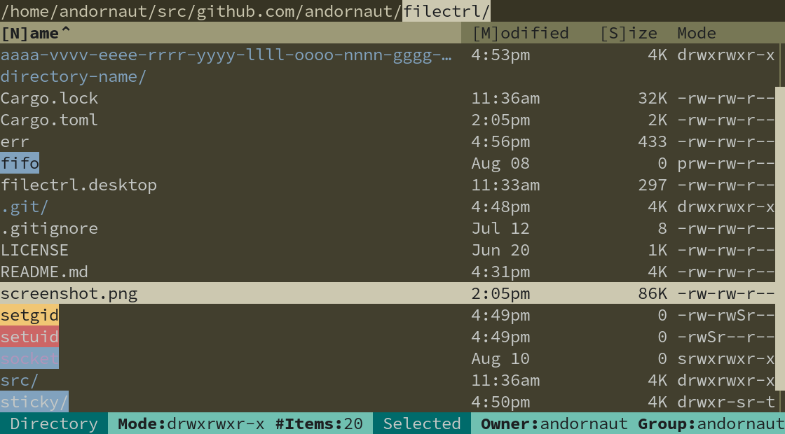

# FileCtrl

FileCtrl is a light, opinionated, responsive, theme-able, and simple Text User Interface (TUI) file manager for Linux and macOS



## Installation

You can [download and install a pre-built binary](https://github.com/andornaut/filectrl/releases) for Linux or macOS:

```bash
curl -sL https://github.com/andornaut/filectrl/releases/download/main/filectrl-linux -o filectrl
chmod +x filectrl
sudo mv filectrl /usr/local/bin/
```

On macOS, allow the _unsigned_ `filectrl` binary to be executed:

```bash
xattr -d com.apple.quarantine filectrl
```

## Building

1. `git clone` and `cd` into this repository
1. Run ```cargo build --release && sudo cp target/release/filectrl /usr/local/bin/```

## Usage

Run `filectrl --help` to view the available command line arguments and options:

```text
Usage: filectrl [<directory>] [-c <config>] [--write-config]

FileCtrl is a light, opinionated, responsive, theme-able, and simple
Text User Interface (TUI) file manager for Linux and macOS

Positional Arguments:
  directory         path to a directory to navigate to

Options:
  -c, --config      path to a configuration file
  --write-config    write the default config to ~/.config/filectrl/config.toml,
                    then exit
  --help            display usage information
```

### Copy / paste

When you copy/cut a file or directory, FileCtrl puts `${operation} ${path}` into your clipboard buffer
(where `operation` is "cp" or "mv").
If you then paste into a second FileCtrl window, this second instance of FileCtrl will perform the equivalent of:
`${operation} ${path} ${current_directory}`, e.g. `cp filectrl.desktop ~/.local/share/applications/`.
Under the hood, FileCtrl doesn't actually invoke `cp` or `mv`, but implements similar operations using the Rust standard library.

### Keyboard controls

_**Normal mode**_

Keys | Description
--- | ---
<kbd>q</kbd> | Quit
<kbd>←</kbd> / <kbd>h</kbd>, <kbd>↓</kbd> / <kbd>j</kbd>, <kbd>↑</kbd> / <kbd>k</kbd>,  <kbd>→</kbd> / <kbd>l</kbd> | Navigate left, down, up, right
<kbd>~</kbd> | Go to home directory
<kbd>←</kbd> / <kbd>b</kbd> / <kbd>Backspace</kbd> | Go to parent directory
<kbd>→</kbd> / <kbd>f</kbd> / <kbd>l</kbd> / <kbd>Enter</kbd> / <kbd>Space</kbd> | Open the selected file using the default application configured in your environment, or navigate to the selected directory
<kbd>o</kbd> | Open the selected file using the program configured by: `templates.open_selected_file`
<kbd>Home</kbd> / <kbd>g</kbd> / <kbd>^</kbd> | Select first row
<kbd>End</kbd> / <kbd>G</kbd> / <kbd>$</kbd> | Select last row
<kbd>z</kbd> | Select middle of visible rows
<kbd>Ctrl</kbd>+<kbd>f</kbd> / <kbd>Ctrl</kbd>+<kbd>d</kbd> / <kbd>PgDn</kbd> | Scroll down one page
<kbd>Ctrl</kbd>+<kbd>b</kbd> / <kbd>Ctrl</kbd>+<kbd>u</kbd> / <kbd>PgUp</kbd> | Scroll up one page
<kbd>Delete</kbd> | Delete the selected file or directory
<kbd> / </kbd> | Filter by name
<kbd>Ctrl</kbd>+<kbd>r</kbd> / <kbd>F5</kbd> | Refresh the current directory
<kbd>r</kbd> / <kbd>F2</kbd> | Rename the selected file or directory
<kbd>w</kbd> | Open a new `filectrl` window in the terminal configured by: `templates.open_new_window`
<kbd>t</kbd> | Open the current directory in the program configured by: `templates.open_current_directory`
<kbd>a</kbd>, <kbd>c</kbd>, <kbd>p</kbd> | Clear alerts, clipboard content, or progress bars
<kbd>Ctrl</kbd>+<kbd>c</kbd>, <kbd>Ctrl</kbd>+<kbd>x</kbd>, <kbd>Ctrl</kbd>+<kbd>v</kbd> | Copy/Cut/Paste selected file or directory
<kbd>n</kbd>, <kbd>m</kbd>, <kbd>s</kbd> | Sort by name, modified date, or size
<kbd>?</kbd> | Toggle help

_**Filtering / Renaming mode**_

Keys | Description
--- | ---
<kbd>Esc</kbd> | Cancel and exit filtering/renaming mode
<kbd>Enter</kbd> | Submit your input and exit filtering/renaming mode
<kbd>←</kbd> / <kbd>→</kbd> | Move cursor
<kbd>Ctrl</kbd>+<kbd>←</kbd> / <kbd>Ctrl</kbd>+<kbd>→</kbd> | Move cursor by word (delimited by whitespaces or punctuation)
<kbd>Home</kbd> / <kbd>End</kbd> | Move cursor to beginning/end of line
<kbd>Shift</kbd>+<kbd>←</kbd> / <kbd>Shift</kbd>+<kbd>→</kbd> | Select text
<kbd>Shift</kbd>+<kbd>Home</kbd> / <kbd>Shift</kbd>+<kbd>End</kbd> | Select to beginning/end of line
<kbd>Ctrl</kbd>+<kbd>Shift</kbd>+<kbd>←</kbd> / <kbd>Ctrl</kbd>+<kbd>Shift</kbd>+<kbd>→</kbd> | Select by word (delimited by whitespaces or punctuation)
<kbd>Ctrl</kbd>+<kbd>a</kbd> | Select all
<kbd>Ctrl</kbd>+<kbd>c</kbd>, <kbd>Ctrl</kbd>+<kbd>x</kbd>, <kbd>Ctrl</kbd>+<kbd>v</kbd> | Copy/Cut/Paste text
<kbd>Backspace</kbd> / <kbd>Delete</kbd> | Delete character before/after cursor

## Configuration

The configuration is drawn from the first of the following:

1. The path specified by the command line option: `--config-path`
1. The default path, if it exists: `~/.config/filectrl/config.toml`
1. The built-in [default configuration](./src/app/default_config.rs)

Run `filectrl --write-config` to write the [default configuration](./src/app/default_config.rs) to `~/.config/filectrl/config.toml`.

### Opening in other applications

- [andornaut@github /til/ubuntu#default-applications](https://github.com/andornaut/til/blob/master/docs/ubuntu.md#default-applications)
- [XDG MIME Applications](https://wiki.archlinux.org/title/XDG_MIME_Applications)

Keyboard key | Description
--- | ---
<kbd>f</kbd> | Open the selected file using the default application configured in your environment
<kbd>o</kbd> | Open the selected file using the program configured by: `templates.open_selected_file`
<kbd>t</kbd> | Open the current directory in the program configured by: `templates.open_current_directory`
<kbd>w</kbd> | Open a new `filectrl` window in the terminal configured by: `templates.open_new_window`

```toml
[templates]
# Programs to use to open files or directories:
# %s will be replaced by the path to the current working directory:
open_current_directory = "alacritty --working-directory %s"
open_new_window = "alacritty --command filectrl %s"
# %s will be replaced by the path to the selected file or directory:
open_selected_file = "pcmanfm %s"
```

### Theming

All colors can be changed by editing the configuration file:

```bash
filectrl --write-config
vim ~/.config/filectrl/config.toml
```

You can see all of the available theme variables in the [default configuration](./src/app/default_config.rs).

### Desktop entry

- ["Desktop Entry" specification](https://specifications.freedesktop.org/desktop-entry-spec/desktop-entry-spec-latest.html)

You can make `filectrl` the default application for opening directories. Start by copying the [`filectrl.desktop` file](./filectrl.desktop) to `~/.local/share/applications/`:

```bash
cp filectrl.desktop ~/.local/share/applications/
xdg-mime default filectrl.desktop inode/directory
update-desktop-database ~/.local/share/applications/
```

## Developing

- [andornaut@github /til/rust](https://github.com/andornaut/til/blob/master/docs/rust.md)
- See [Cargo.toml](./Cargo.toml) for dependencies.
- [Download files and folders of various types to test colors](https://github.com/seebi/dircolors-solarized/raw/refs/heads/master/test-directory.tar.bz2)

```bash
cargo clippy
cargo fix --allow-dirty --allow-staged
cargo test
cargo run
cargo build --release
./target/debug/filectrl

# Log to ./err
RUST_LOG=debug cargo run 2>err
```

### Git hooks

- [cargo-husky](https://github.com/rhysd/cargo-husky)

[Changing cargo-husky configuration](https://github.com/rhysd/cargo-husky/issues/30):

1. Edit the `[dev-dependencies.cargo-husky]` section of [Cargo.toml](./Cargo.toml)
1. `rm .git/hooks/pre-commit` (or other hook file)
1. `cargo clean`
1. `cargo test`
1. Verify that the changes have been applied to `.git/hooks/pre-commit`
